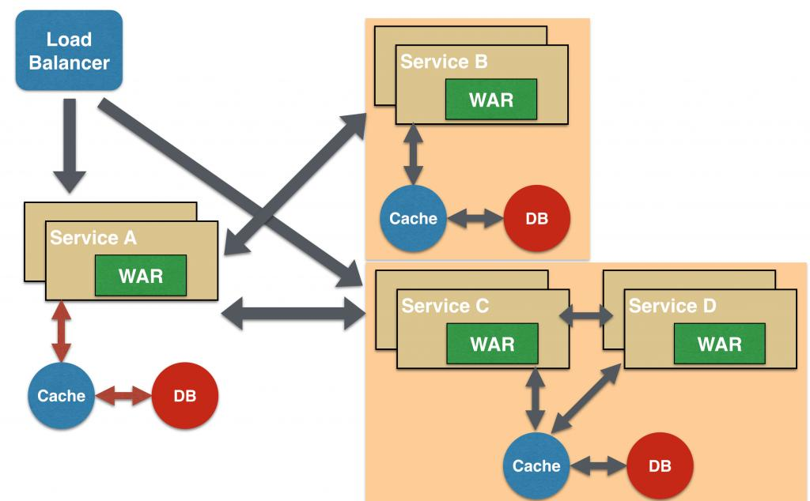

### JMS & Microservices

##### Network protocols (http (tcp/ip), socket, JMS, file, database, WebSocket)  tcp = host (ip address) + port

##### JMS (Kafka, Redis, RebitMQ) -> Message Queue

##### Microservice: Java file (JAR, WAR) + config

##### Kafka: topic[1...n] + producer + consumer

##### Spring Cloud (server of configurations)

##### Properties:

1. Discovery -> Service Discovery
2. Fault tolarance -> Circuit Breaker
3. Resilience -> Load Balancing
4. Configuration -> Configuration
5. API management -> API gateway

docker-compose -f .\docker-compose-for-kafka.yml up

##### Patterns:

1. Aggregator
   
2. Agent
   
3. Chain
   
4. Branch
   
5. Data sharing
   
6. Asynchronous messaging
   

